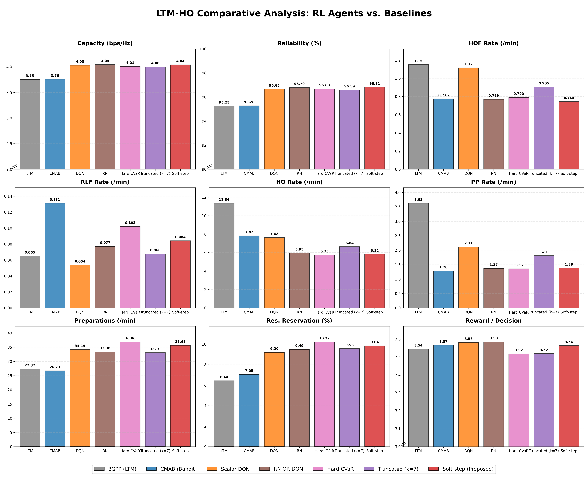
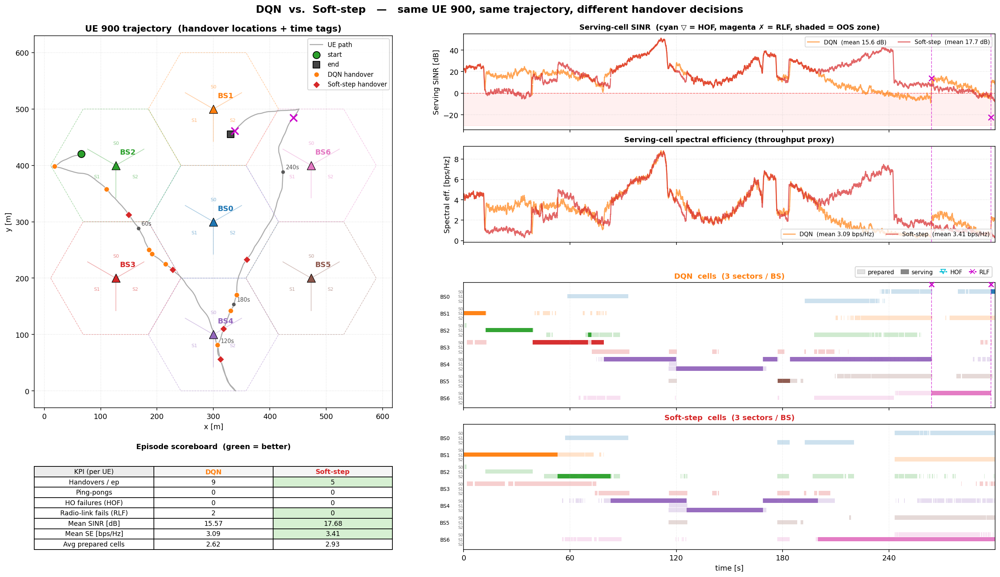
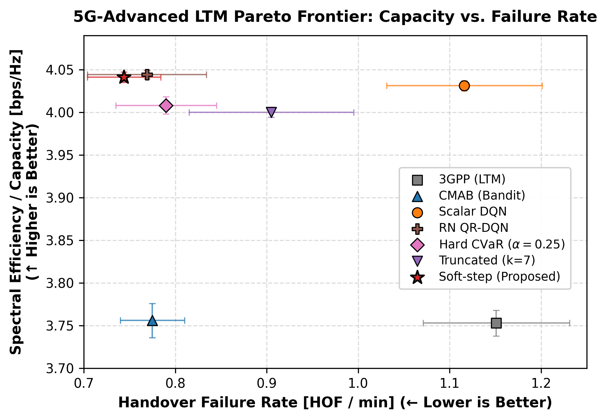
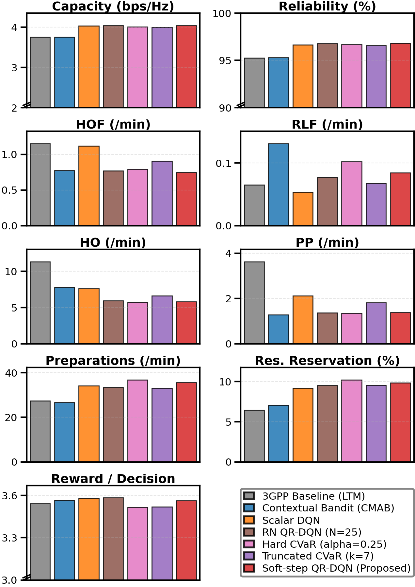
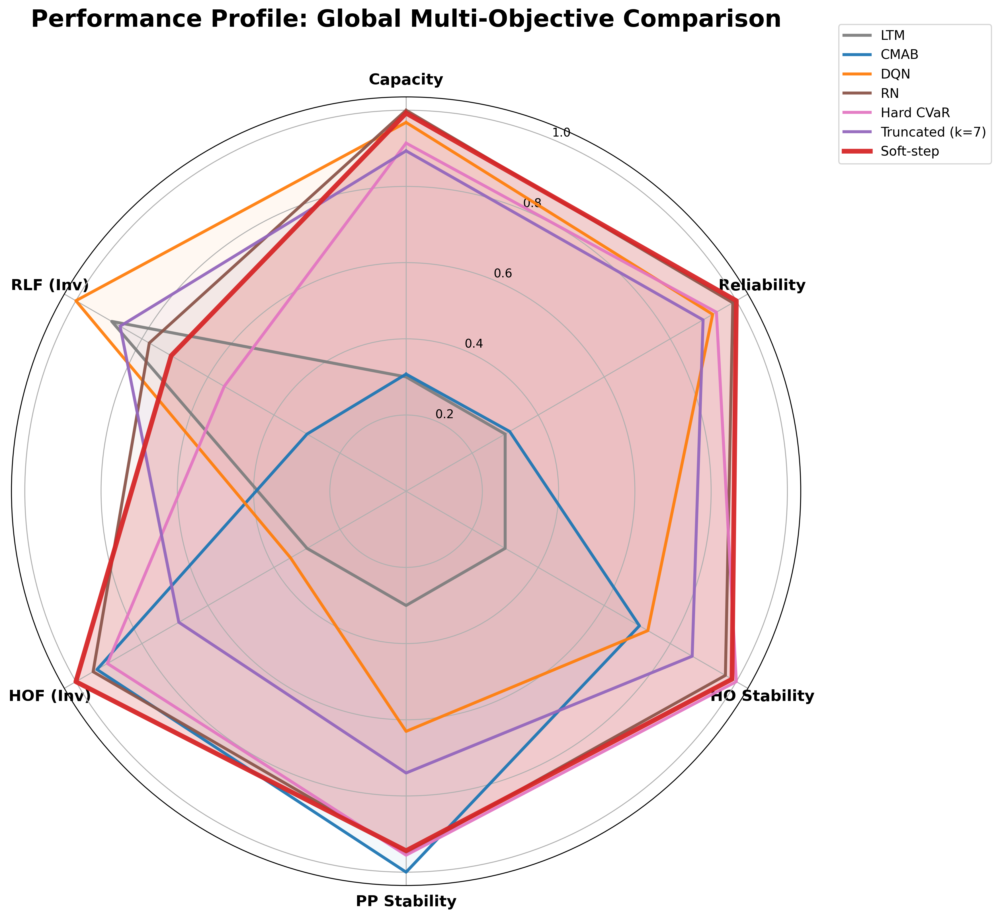
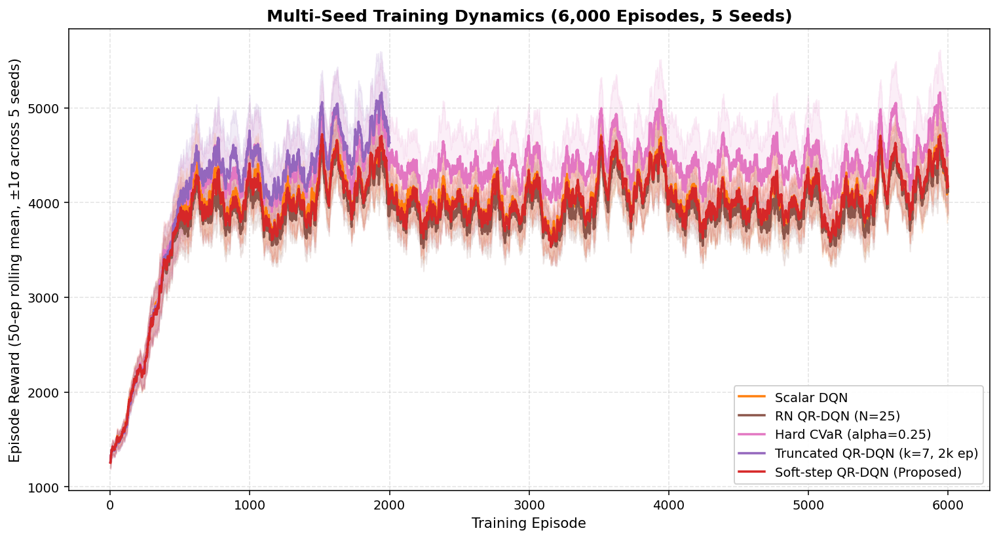
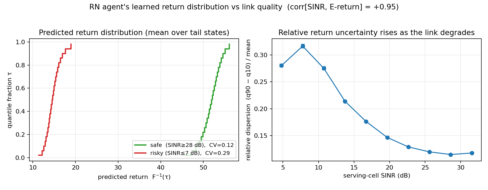

# Risk-Aware Distributional Reinforcement Learning for 5G-Advanced Handover Decisions

[](https://www.comsoc.org/publications/journals/ieee-tmlcn)
[](LICENSE)
[](https://www.python.org/downloads/)
[](https://pytorch.org/)

Official code repository for the paper:
> **"Risk-Aware Distributional Reinforcement Learning for 5G-Advanced Handover Decisions"**  
> Gerard Grau Garcia, Ainna Yue Moreno-Locubiche, Josep Vidal, Margarita Cabrera-Bean  
> *IEEE Transactions on Machine Learning in Communications and Networking (TMLCN)*, 2026.

---

## Overview

In 5G-Advanced **Lower Layer Triggered Mobility (LTM)**, handover decisions must balance throughput against reliability under fast-varying radio conditions. While rare, costly tail events—**handover failures (HOF)** and **radio-link failures (RLF)**—dominate the user experience.

Standard reinforcement learning (DQN) optimizes the *expected* return 𝔼[R] and is indifferent to dispersion. This project implements **Quantile Regression Distributional Reinforcement Learning (QR-DQN)** combined with **Conditional Value at Risk (CVaR)** to explicitly optimize the worst-case lower tail of the return distribution.

<p align="center">
  <br>
  <sub><b>5G-Advanced LTM Mobility Simulation.</b> Real-time visualization of a mobile user navigating the 7-site, 21-sector cellular deployment under QR-DQN control. The agent dynamically triggers L1/L2 handovers to maintain high SINR and spectral efficiency while proactively mitigating radio link failures.</sub>
</p>

<p align="center">
  <br>
  <sub><b>Figure 1: Comprehensive 9-KPI out-of-domain evaluation on 1,000 unseen test trajectories (5 independent seeds).</b> Comparison across all standardized physical and operational KPIs for the 3GPP LTM baseline, contextual bandits (CMAB), scalar DQN, and distributional variants. <b>Soft-step QR-DQN</b> achieves peak reliability (96.81%) and capacity (4.04 bps/Hz) while cutting handover failures by 33% and minimizing ping-pong oscillations.</sub>
</p>

### Key Findings & Contributions

1. **Separable Distributional Gain**: Distributional learning alone lowers handover, ping-pong, and failure rates at equal reward per decision compared to scalar DQN.
2. **The Generalization Champion (Soft-step QR-DQN)**: Applying a smooth spectral risk weight (*r* = 2.0 on the lower quartile α = 0.25) over the full learned distribution (*N* = 25) cuts the handover failure rate of DQN by **33%** and achieves the lowest HOF rate (**0.74 ± 0.07**/min) and highest reliability (**96.8%**) of all evaluated methods on unseen channels.
3. **The Danger of Tail Truncation**: Restricting the neural network output exclusively to lower quantiles (*k* = 1, 3, 7) degrades performance by up to +27.5% in unseen test environments because the trunk network is starved of global gradient signals. Full-distribution learning is strictly necessary for out-of-domain generalization.
4. **Benchmark Evaluation**: Rigorous evaluation on 2,000 training trajectories and 1,000 unseen test trajectories (ε = 0.0), outperforming both the standard 5G LTM heuristic and contextual-bandit (CMAB) baselines across every physical safety and throughput KPI.

---

## Master Benchmark Results

All models evaluated strictly greedily (ε = 0.0) with frozen network weights across **1,000 unseen test trajectories** over 5 independent random seeds (42–46):

| Policy | Throughput ↑ | Reliability ↑ | HOF ↓ | RLF ↓ | HO ↓ | PP ↓ | Prep ↓ | Resv. ↓ | Reward ↑ |
| :--- | :---: | :---: | :---: | :---: | :---: | :---: | :---: | :---: | :---: |
| **3GPP (LTM)** | 3.75 | 95.2% | 1.15 | <ins>0.07</ins> | 11.3 | 3.6 | <ins>27.3</ins> | **6.4%** | 3.52 |
| **CMAB (Bandit)** | 3.76 | 95.3% | 0.77 | 0.13 | 7.8 | **1.3** | **26.7** | <ins>7.1%</ins> | 3.57 |
| **Scalar DQN** | 4.03 | 96.7% | 1.12 | **0.05** | 7.6 | 2.1 | 34.2 | 9.2% | <ins>3.58</ins> |
| **RN QR-DQN** | **4.04** | <ins>96.8%</ins> | <ins>0.77</ins> | 0.08 | 5.9 | 1.4 | 33.4 | 9.5% | **3.58** |
| **Hard CVaR (α = 0.25)** | 4.01 | 96.7% | 0.79 | 0.10 | **5.7** | <ins>1.4</ins> | 36.9 | 10.2% | 3.52 |
| **Truncated (k = 7)** | 4.00 | 96.6% | 0.90 | 0.07 | 6.6 | 1.8 | 33.1 | 9.6% | 3.52 |
| **Soft-step (Proposed)** | <ins>4.04</ins> | **96.8%** | **0.74** | 0.08 | <ins>5.8</ins> | 1.4 | 35.7 | 9.8% | 3.56 |

> *Bold indicates the best result; underline indicates the second-best.*  
> *KPI Glossary & Units: Throughput in bps/Hz; Reliability & Reservation (Resv.) in %; Handover Failures (HOF), Radio Link Failures (RLF), Handovers (HO), Ping-Pong (PP), and Preparations (Prep) normalized per minute.*  
> *Deep RL delivers **+7.7% throughput** over contextual bandits without mobility degradation, while **Soft-step QR-DQN** cuts handover failures by **33%** compared to scalar DQN.*  
> *For the complete 9-KPI breakdown and error bars across all evaluated models (including k = 1 RA-1q, k = 3, Hard CVaR α ∈ {0.10, 0.25}, prep rate, and resource reservations), see Table II in [the IEEE TMLCN paper](paper_tmlcn/tmlcn-template.pdf) or [`results/final_metrics/`](results/final_metrics/).*

---

## Visualizations

### Policy Stability & Head-to-Head Trajectory Comparison

Evaluating policies on identical mobile trajectories highlights why distributional risk awareness is essential. Under deep multipath fading, scalar DQN suffers severe link degradation and crashes into Outage/RLF. In contrast, Soft-step QR-DQN anticipates fading drops, executing timely handovers that eliminate failures while boosting throughput:

<p align="center">
  <br>
  <sub><b>Head-to-Head Policy Comparison (UE 900): Scalar DQN vs. Proposed Soft-step QR-DQN.</b> Evaluated on the exact same channel fading realization. Scalar DQN suffers 2 radio-link failures (RLF, magenta ✗), lower average SINR (15.57 dB), and lower throughput (3.09 bps/Hz). Soft-step QR-DQN achieves <b>0 failures</b> (0 RLF, 0 HOF), cuts handovers from 9 to 5, increases average SINR to <b>17.68 dB (+2.1 dB)</b>, and boosts spectral efficiency to <b>3.41 bps/Hz (+10.3%)</b>.</sub>
</p>

### Pareto Frontier: Spectral Efficiency vs. Failure Rate

<p align="center">
  <br>
  <sub><b>5G-Advanced LTM Pareto Frontier (Capacity vs. Handover Failure Rate).</b> Evaluated across 1,000 unseen test trajectories over 5 independent random seeds (error bars denote ±1 standard deviation). Proposed <b>Soft-step QR-DQN</b> and <b>Risk-Neutral QR-DQN</b> define the optimal Pareto frontier, achieving peak capacity (4.04 bps/Hz) while cutting handover failures by 33% relative to scalar DQN and 36% relative to 3GPP LTM.</sub>
</p>

### Benchmark Profiles & KPI Breakdown

<table>
<tr>
<td width="48%" valign="top">
  <br>
  <sub><b>Single-Column 5×2 KPI Layout.</b> Publication-ready format from the IEEE TMLCN manuscript comparing all 9 KPIs alongside the unified algorithm legend.</sub>
</td>
<td width="52%" valign="top">
  <br>
  <sub><b>Multi-Objective Radial Scoreboard.</b> Normalized performance profile across capacity, reliability, and mobility safety dimensions.</sub>
</td>
</tr>
</table>

### Training Dynamics & Value Distributions

<table>
<tr>
<td width="50%" valign="top">
  <br>
  <sub><b>Multi-Seed Training Dynamics (6,000 Episodes).</b> Cross-seed mean reward and ±1σ standard deviation bands across 5 independent random seeds (42–46). Truncated QR-DQN (k=7) is shown from its 2,000-episode architecture ablation, alongside 6,000-episode convergence for DQN, RN QR-DQN, Hard CVaR, and proposed Soft-step QR-DQN.</sub>
</td>
<td width="50%" valign="top">
  <br>
  <sub><b>Learned Value Distributions & Risk Perception.</b> (Left) Predicted return distribution CDF for representative safe (high SINR, green) versus risky (deep fading, red) radio conditions. (Right) Relative return dispersion rising sharply as serving SINR drops, confirming that the distributional network explicitly learns channel uncertainty.</sub>
</td>
</tr>
</table>

---

## Repository Structure

```
risk-aware-dist-rl-5g-handover/
├── configs/            # Experiment configurations
│   ├── models/         # Canonical configs for all models in Table II
│   └── README.md       # Configuration documentation
├── data/               # Channel datasets and precomputed caches
│   └── sample/         # Lightweight sample dataset (<1 MB) for immediate testing
├── docs/assets/        # High-resolution figures and demonstration assets
├── figures/            # Curated publication figures and analysis plots
├── paper_tmlcn/        # IEEE TMLCN camera-ready LaTeX manuscript and compiled PDF
├── results/            # Benchmark logs, checkpoints, and master evaluation CSVs
│   └── final_metrics/  # Cross-seed aggregated CSV summaries and plots
├── scripts/            # Shell utilities (e.g. dataset download script)
└── src/
    ├── distrl/         # Core framework (agents, networks, physics, Gymnasium env)
    ├── scripts/        # Verification and unit smoke test scripts
    ├── tools/          # Plot generators and dataset preprocessing tools
    └── main.py         # Main training and benchmarking entrypoint
```

---

## Getting Started

### 1. Installation

Clone the repository and set up the virtual environment:

```bash
git clone https://github.com/gerardgrau/risk-aware-dist-rl-5g-handover.git
cd risk-aware-dist-rl-5g-handover

python3 -m venv venv-RL
./venv-RL/bin/pip install -r requirements.txt
```

### 2. Set PYTHONPATH

Before invoking scripts, set the Python search path:

```bash
export PYTHONPATH=$PYTHONPATH:$(pwd)/src
```

### 3. Quickstart with Sample Data (<1 MB)

The repository includes a lightweight sample dataset in `data/sample/no_ris/` so you can immediately run verification and smoke tests without downloading the full multi-gigabyte dataset:

```bash
# Verify environment and agent execution
./venv-RL/bin/python3 src/scripts/test_dqn_ltm.py
./venv-RL/bin/python3 src/scripts/test_qrdqn_ltm.py
./venv-RL/bin/python3 src/scripts/test_quantile_modes.py
./venv-RL/bin/python3 src/scripts/test_metrics_calc.py
```

### 4. Full Dataset Acquisition (25 GB)

To reproduce the complete 3,000-UE benchmark (2,000 train UEs in `data/train/` and 1,000 test UEs in `data/test/`), download and unpack the dataset. The dataset is hosted on [Zenodo (Record 23124881)](https://zenodo.org/records/23124881) partitioned into 6 multipart volumes (`.part01`–`.part06`) for reliable multi-gigabyte transfers. You can run the automated downloader which fetches, verifies, concatenates, and extracts all volumes:

```bash
./scripts/download_dataset.sh
```

*(Alternatively, if downloading manually from Zenodo, concatenate the 6 volumes with `cat 5g_advanced_ltm_channel_trajectories.zip.part* > 5g_advanced_ltm_channel_trajectories.zip` and extract into `data/`).*

Once downloaded, generate the fast precomputed `.npz` cache:

```bash
./venv-RL/bin/python3 src/tools/preprocess_dataset.py
```

---

## Training & Evaluation

### Training Canonical Models

Train any model from Table II using the configurations under `configs/models/`:

```bash
# Train proposed champion (Soft-step QR-DQN)
./venv-RL/bin/python3 src/main.py --config configs/models/softstep.yaml --device cpu

# Train Risk-Neutral QR-DQN baseline
./venv-RL/bin/python3 src/main.py --config configs/models/rn.yaml --device cpu

# Train Scalar DQN baseline
./venv-RL/bin/python3 src/main.py --config configs/models/dqn.yaml --device cpu
```

Outputs will be saved in `results/benchmarks/bmk_<date>_<id>_<desc>/` containing training logs, models, and evaluation results.

### Evaluate Pre-Trained Checkpoints

Evaluate frozen-weight policies across all 1,000 test trajectories (ε = 0.0):

```bash
./venv-RL/bin/python3 src/evaluate_model.py \
    --agent qrdqn \
    --model results/benchmarks/<run>/models/qrdqn_best.pth \
    --config configs/models/softstep.yaml \
    --output results/final_metrics/qrdqn_softstep
```

### Regenerate Master Publication Plots

```bash
./venv-RL/bin/python3 src/tools/generate_final_plots.py
./venv-RL/bin/python3 src/tools/plot_risk_frontier.py
./venv-RL/bin/python3 src/tools/plot_return_density.py
```

Generated plots will be saved to `results/final_metrics/plots/`.

---

## Manuscript & Citation

The IEEE TMLCN journal manuscript source files and compiled PDF are available under [`paper_tmlcn/`](paper_tmlcn/).

If you use this codebase or find our work helpful in your research, please cite:

```bibtex
@article{graugarcia2026riskaware,
  author    = {Grau Garcia, Gerard and Moreno-Locubiche, Ainna Yue and Vidal, Josep and Cabrera-Bean, Margarita},
  title     = {Risk-Aware Distributional Reinforcement Learning for 5G-Advanced Handover Decisions},
  journal   = {IEEE Transactions on Machine Learning in Communications and Networking},
  year      = {2026},
  publisher = {IEEE},
  note      = {\url{https://github.com/gerardgrau/risk-aware-dist-rl-5g-handover}}
}
```

---

## License

This project is licensed under the MIT License — see the [`LICENSE`](LICENSE) file for details.
